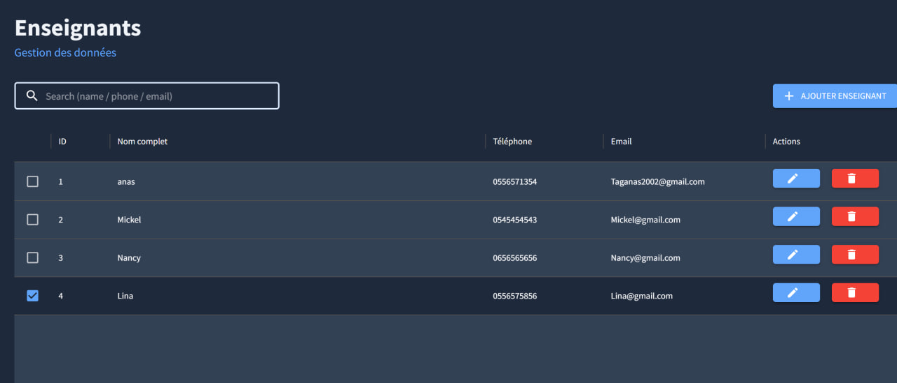
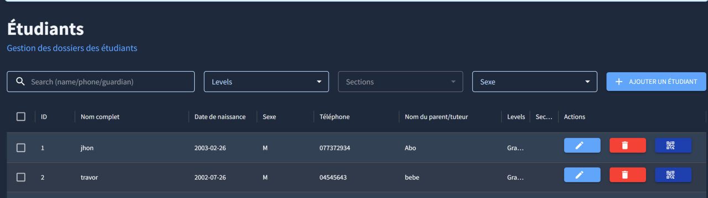
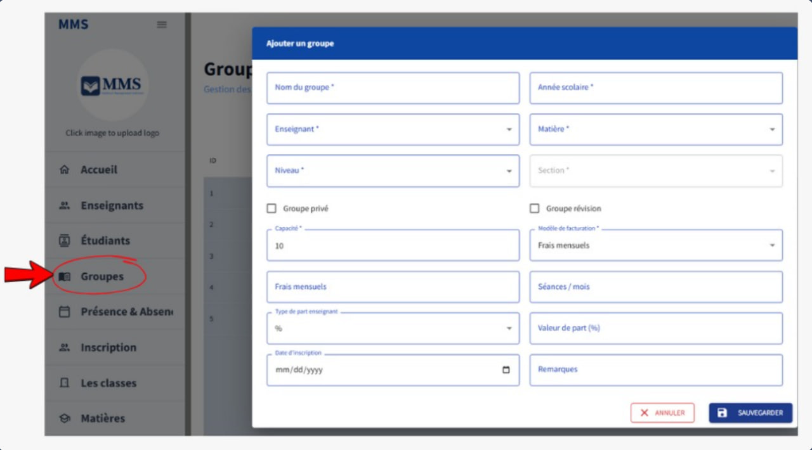
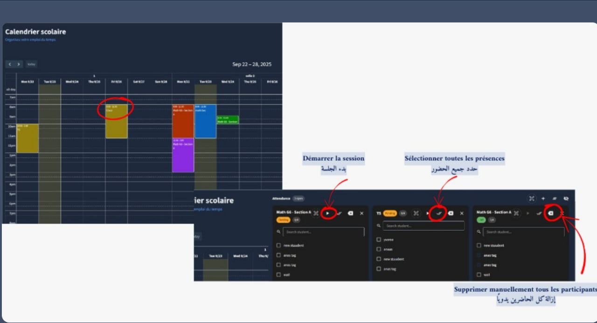
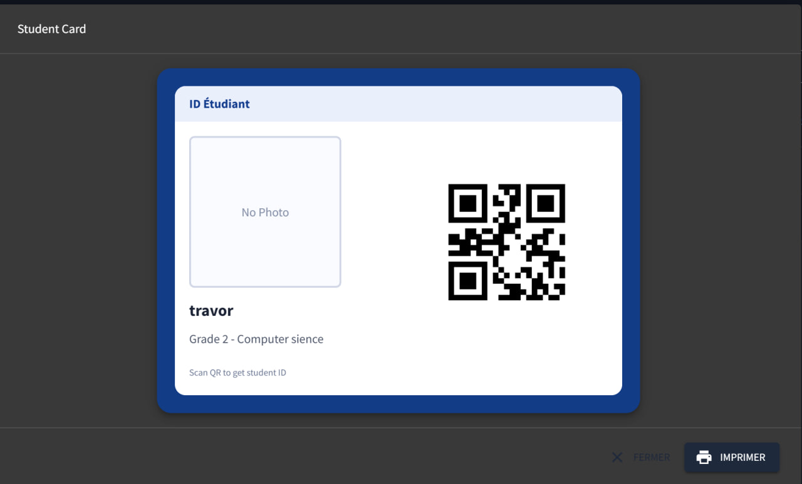

# Madrasti Management System (MMS)

A desktop school management system for managing students, teachers, classes, timetables, attendance, registration, appointments, and school finances — built for real-world school operations with offline support.

## What it does
MMS helps a school:
- Manage student and teacher records
- Organize groups, classes, subjects (matières), levels (niveau) and sections
- Build and edit timetables (emploi du temps)
- Manage registration/enrollment (inscription)
- Track attendance (présence & absence)
- Support student appointments/check-ins via **QR code scan**
- Show attendance stats per group/session (how many students attended)
- Track finances: revenues, expenses, profit & loss, and teacher salary
- Securely manage staff accounts with roles and permissions

## Tech Stack
- Frontend: React, Axios
- Desktop: Electron.js
- Backend: Spring Boot (Java 21)
- Auth: JWT (authentication & authorization)
- Databases:
  - MySQL (standard / server mode)
  - SQLite (offline / USB-licensed mode)

## Modes (Deployment)
- **Trial / Online build:** runs without USB (link-based distribution)
- **USB Licensed build:** offline-ready using SQLite + one-time activation per PC (USB-based licensing)

## Modules (Sidebar)
- Teachers (Enseignants)
- Students (Étudiants)
- Groups (Groupes)
- Classes (Les classes)
- Subjects (Matières)
- Levels (Niveau)
- Sections
- Timetable (Emploi du temps)
- Registration (Inscription)
- Attendance (Présence & Absence)
- Finance:
  - Revenues (Revenus)
  - Expenses (Dépenses)
  - Profit & Loss (Profit & Perte)
  - Teacher Salary (Salaire des enseignants)
- Users (Utilisateurs)

## Users, Roles & Permissions
MMS supports multiple staff accounts with secure login (username/password) and JWT authentication.

Access is controlled using **custom roles + permissions**:
- Admins can **create roles**
- Each role can be assigned **menu/module permissions** (what appears in the sidebar + what actions are allowed)
- Then a role is assigned to a user account

## Trial (15 days)
Download (Google Drive): https://drive.google.com/file/d/1uRmfu19WoQcwFdVe1jVVtBAemXTLPq7k/view?usp=drivesdk

### Requirements
- Windows 10/11 (64-bit)
- 32-bit Windows is not supported

## Screenshots
- Teachers  
  

- Students  
  

- Groups (Create Group)  
  

- Timetable + Attendance  
  

- Student QR Card  
  

## Notes
This is a commercial product. Source code is private.  
If you want the full licensed version (USB activation), contact me.

## Contact
- LinkedIn: www.linkedin.com/in/tag-anas
- Email: taganas2002@gmail.com
